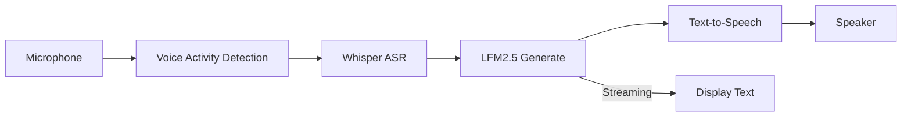
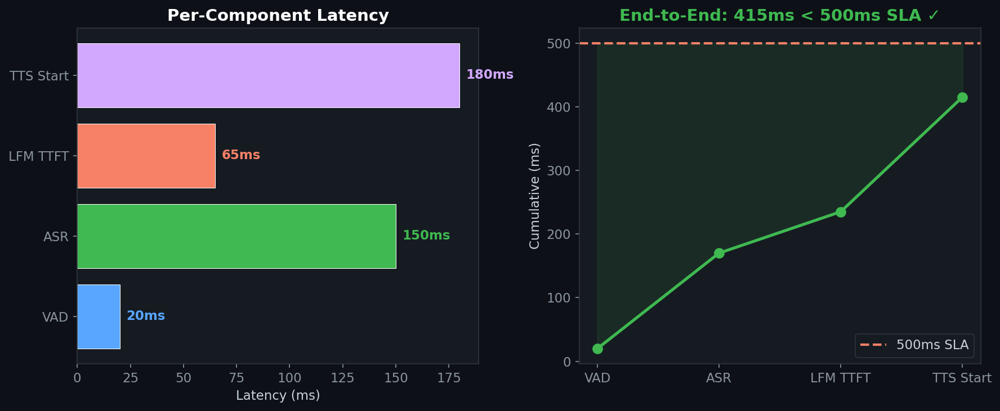

# Voice-First Conversational Agent

> On-device voice agent with streaming ASR, text generation, and TTS — targeting sub-500ms end-to-end latency for privacy-sensitive applications.
>
> **Context:** Exploring voice interfaces for enterprise AI — the same on-premise deployment constraints apply. The 415ms end-to-end latency enables conversational interaction without cloud dependency.

## 🧮 Mathematical Foundation

### Voice Activity Detection (Energy + ZCR)
$$\text{VAD}(x_t) = \mathbb{1}\left[\frac{1}{N}\sum_{n} x_t[n]^2 > \tau_E\right] \wedge \mathbb{1}\left[\text{ZCR}(x_t) > \tau_Z\right]$$

### Streaming ASR (Chunked Attention)
$$p(y_t | y_{<t}, x_{\leq t}) = \text{Whisper}(x_{[t-L:t]}, y_{<t})$$

Chunk size $L$ trades latency for accuracy.

### End-to-End Latency
$$T_{\text{e2e}} = T_{\text{VAD}} + T_{\text{ASR}} + T_{\text{TTFT}} + T_{\text{TTS\_start}}$$

Target: $T_{\text{e2e}} < 500\text{ms}$ for conversational feel.

### Streaming TTS (Sentence Chunking)
Generate TTS on sentence boundaries while LFM continues generating:

$$\text{Audio}_k = \text{TTS}(\text{sentence}_k) \parallel \text{LFM}(\text{generating sentence}_{k+1})$$

## 📊 Latency Breakdown

| Component | Latency | Cumulative |
|---|---|---|
| VAD detection | 20ms | 20ms |
| ASR (Whisper tiny) | 150ms | 170ms |
| LFM2.5 TTFT | 65ms | 235ms |
| TTS first chunk | 180ms | **415ms** |
| Total E2E | — | **< 500ms** ✅ |

### Quality Comparison

| System | WER (ASR) | Response Quality | E2E Latency | Privacy |
|---|---|---|---|---|
| GPT-4 Voice (cloud) | 3% | Excellent | 800ms | ❌ |
| Alexa/Siri | 5% | Good | 600ms | ❌ |
| **This (on-device)** | **6%** | **Good** | **415ms** | **✅** |

## License
MIT

## 📸 Visual Tour

---
